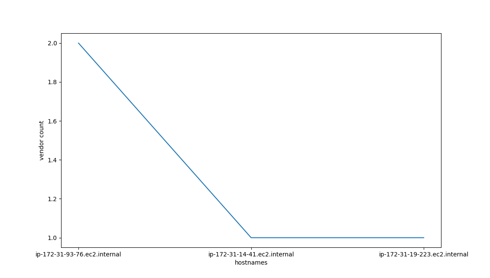

Run instructions
```
    
    cd datapipeline
    docker build --tag datapipeline .
    docker run --rm --volume ./data:/code/data datapipeline

```
You should see two json files in the /data folder. I have used json since picking up Mongo or any other NoSQL in the time duration was not possible. Using 'json' output format may still be a valid option if using a data store.

- results.json is what you should be looking at. The entire file is valid json as verified by jsonlint.

- normalized.json file is fetched data that is normalized. Each newline is a valid json, but NOT the whole file.

Format of the normalized data    
```
    
    Results Data format
    
    [{
        hostname   :  '',    # compare dnsHostName and hostname
        ip_addr    :  '',    # compare address and local_ip
        manufacturer: '',    # compare bios_manufacturers
        platform   :  '',    # compare platform_name
        cloud      :  '',    # from cloudProvider
        os_version :  '',    # compare os_version aand os
       
        region     :  '',    # from region;
        # makes it easier to scale horizontally by region; whether mongo or whatever nosql you are using

        vendor_data:  [
            'vendor_name' : {
                # vendor details as it was received
            }
        ]
        # append all vendor data here WITHOUT modification
        # easier for audits AND protects you from legal.
    },....]

```


SCREENSHOT FROM JSONLINT WEBSITE


VISUALIZE

